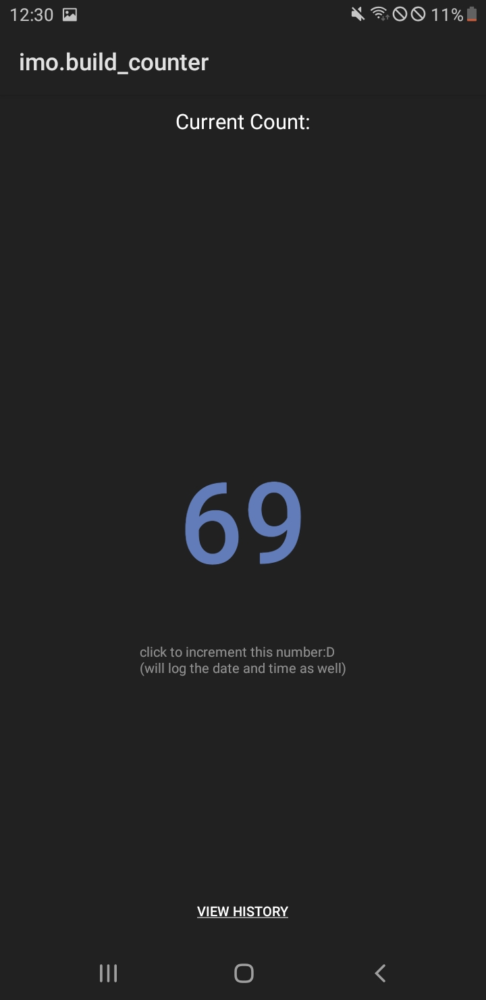

  

# Build Counter

an AIDE Project :D

> [!NOTE]
> just a note nothing else.

an app that makes u count how many times u install an app. (preferably after u hit run on AIDE)

this is a remake of [installCounter](https://github.com/IMOitself/install_counter)

# how to get this?
**apk?** soon.

**project?** instructions soon.