# Overview

This is what the folder looks like when u clone / download it
``` bash
|-main
  |- assets
  |- java
  |- res
  |- AndroidManifest.xml
  |- ReadMe.md
```

At the end of this instructions you'll have a project folder that look like this
``` bash
   |- BuildCounter
       |- build
       |- app
          |- src
             |- main
                 |- assets
                 |- java
                 |- res
                 |- AndroidManifest.xml
                 |- ReadMe.md
```

The following are the steps to get the project to your AIDE <br> <br>
In simplified terms:
- Download (clone) this repository
- Generate a project
- Overwrite the main folder with the downloaded main folder

> [!NOTE]
> just a note again, nothing else:D

# Download

### Using MGit
> (if u dont have MGit get it at [Google Play](https://play.google.com/store/apps/details?id=com.manichord.mgit) or [FDroid](https://f-droid.org/packages/com.manichord.mgit))

- open MGit and hit the '+' icon. 

- 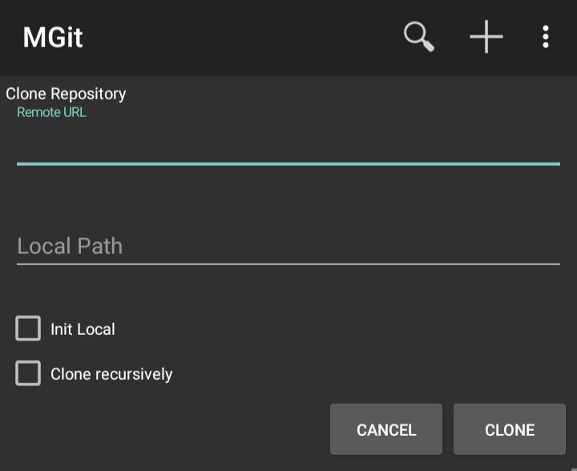

- put `https://github.com/IMOitself/build_counter.git` to "Remote URL".

- 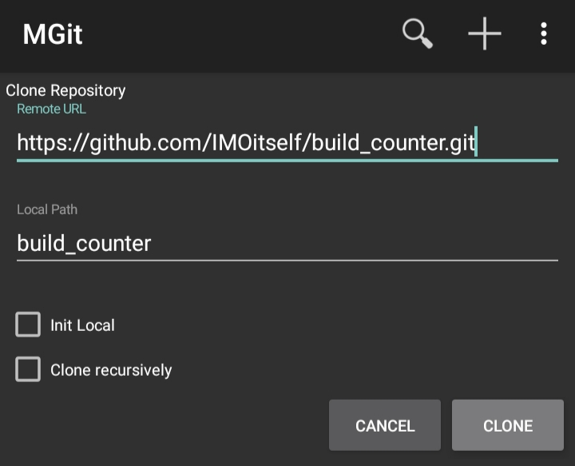

- hit "Clone" button

- 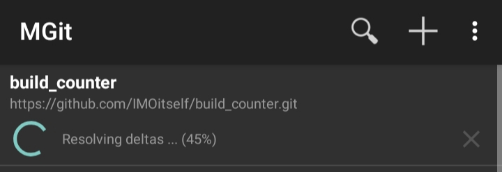

- and ta-da!

files are downloaded to <br>
`/storage/emulated/0/Android/data/com.manichord.mgit/files/repo/`

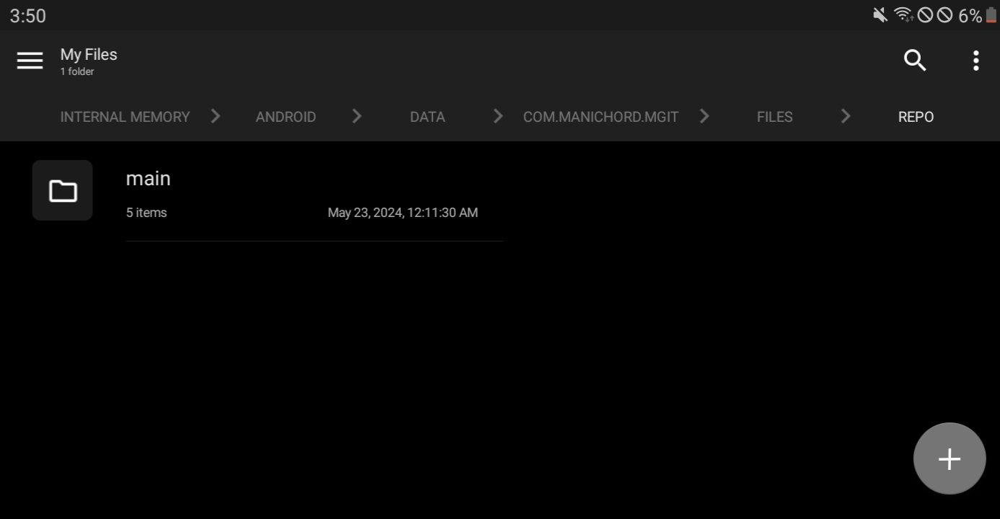

the folder shown above:

``` bash
|-Android
   |- data
       |- com.manichord.mgit
          |- cache
          |- files
              |- diff
              |- repo
                  |-main      <-- this is the folder:D
```

----
# Generate Project

### Using AIDE
- create a 'New Android App'

- 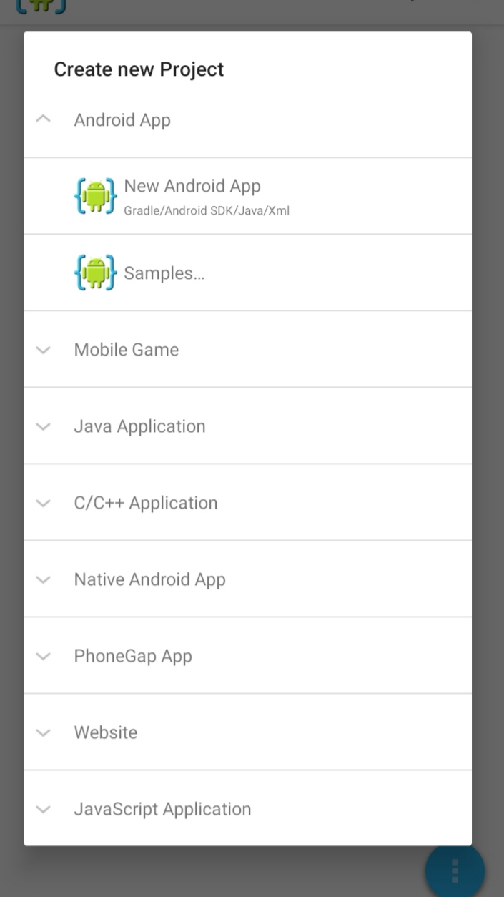
- 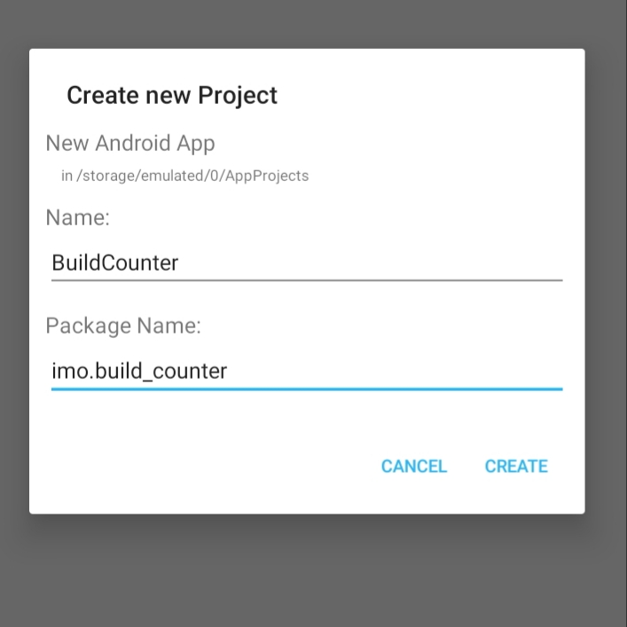

- Name: `BuildCounter` <br> Package Name: `imo.build_counter`.

# Paste Downloaded Folder

### Using (any file explorer)
> the following example images shown below is from Solid Explorer with a customized theme:D

- navigate to the project folder u generated with AIDE earlier at <br>
`/storage/emulated/0/AppProjects/BuildCounter/app/src/`

- 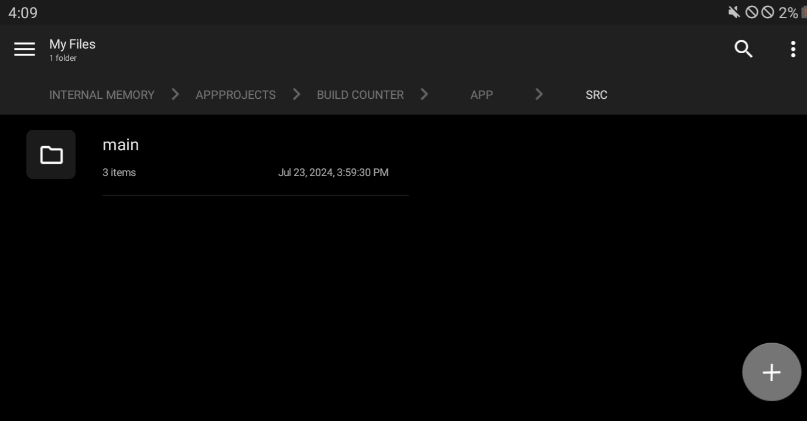

- the folder shown above:

``` bash
|-AppProjects
   |- BuildCounter
       |- build
       |- app
          |- src
             |- main     <-- this is the folder:D
```
- delete the main folder

- 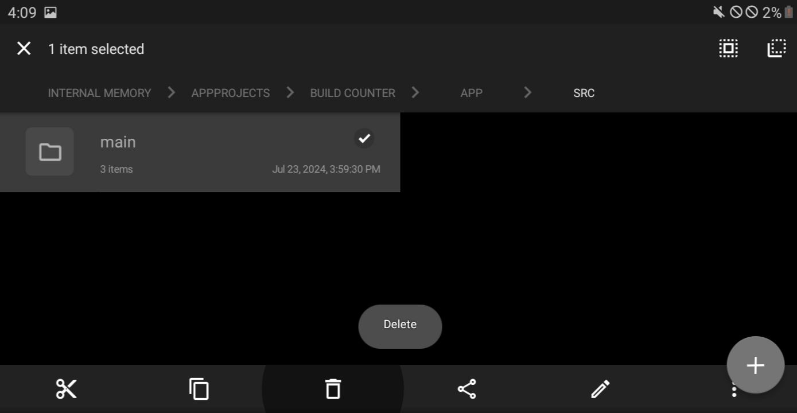
- 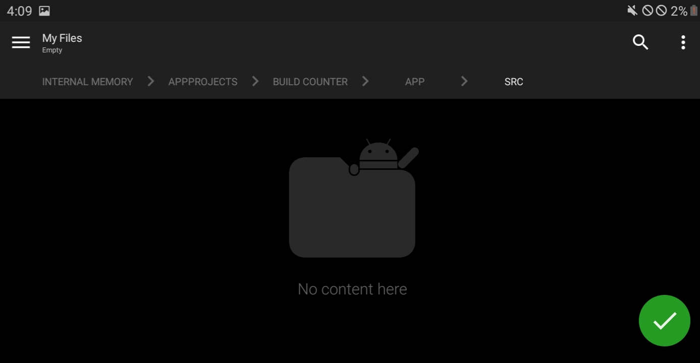

- navigate back to the downloaded main folder at <br>
`/storage/emulated/0/Android/data/com.manichord.mgit/files/repo/`

- 

- the folder shown above:

``` bash
|-Android
   |- data
       |- com.manichord.mgit
          |- cache
          |- files
              |- diff
              |- repo
                  |-main      <-- this is the folder:D
```

- copy it
- 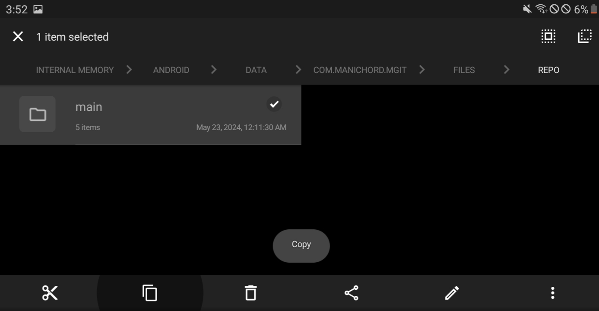

- paste it to <br>
`/storage/emulated/0/AppProjects/BuildCounter/app/src/`

- 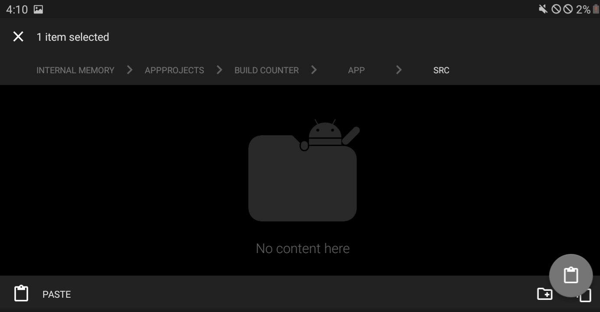
- 

- the folder shown above:

``` bash
|-AppProjects
   |- BuildCounter
       |- build
       |- app
          |- src
             |- main     <-- this is the folder:D